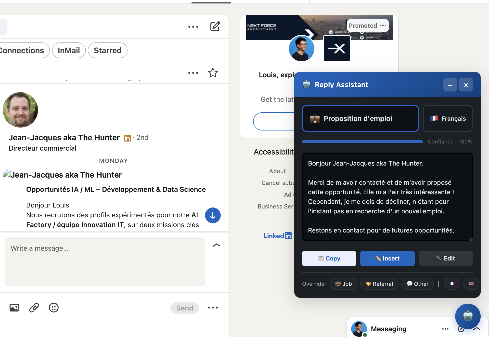
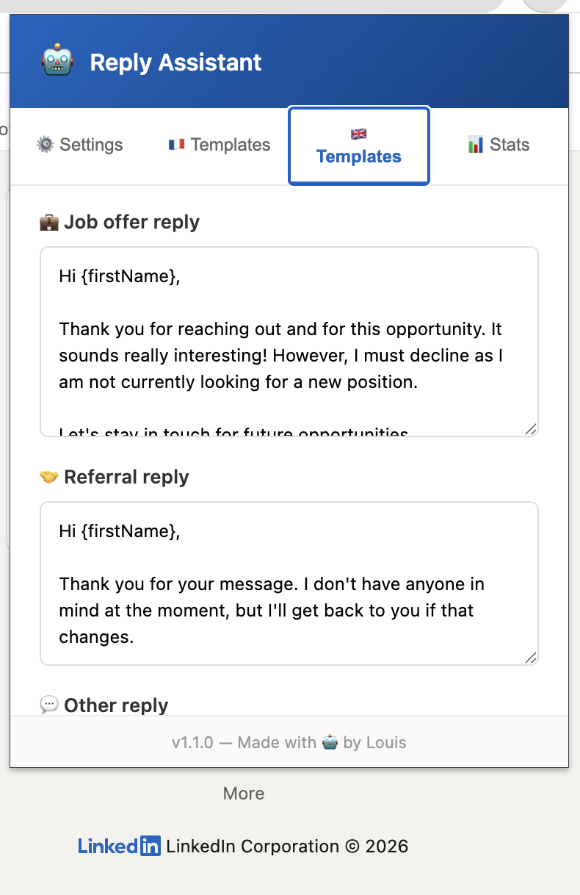

<p align="center">
  
</p>

<h1 align="center">LinkedIn Reply Assistant</h1>

<p align="center">
  <em>Draft polished replies to recruiter messages in one click — no API, no account, nothing leaves your browser.</em>
</p>

<p align="center">
  
  
  
  
  
  
</p>

<br/>

<p align="center">
  
</p>

<br/>

## The Problem

If you're active on LinkedIn, you know the drill: dozens of recruiter messages every week asking if you're open to new opportunities or if you know someone who is. Replying to each one manually is tedious. Ignoring them feels rude.

**LinkedIn Reply Assistant** fixes this. It sits quietly on your LinkedIn messaging page, reads incoming messages, figures out what the recruiter wants, and drafts a polished reply in the right language. You review it, click insert, done.

No AI service. No API key. No data sent anywhere. Everything runs locally in your browser.

<br/>

## Features

- **Smart intent detection** — classifies messages as job offer, referral request, or other using 80+ weighted keywords in French and English
- **Automatic language detection** — detects whether the recruiter wrote in French or English and replies in the same language; force either with one click
- **One-click replies** — copy to clipboard, insert directly into the LinkedIn message box, or unlock the text area to edit before sending
- **Fully customizable templates** — edit every template from the popup; use `{firstName}`, `{name}`, and `{userName}` variables for personalization
- **Confidence score** — shows how confident the classifier is in its intent detection
- **Privacy first** — zero API calls, zero tracking, zero accounts; runs entirely in your browser

<br/>

## How It Works

```
Open a LinkedIn conversation
         │
         ▼
Extension reads the latest messages
         │
         ▼
Classifier scores keywords (80+ terms, FR + EN)
  ├── Job offer?         → drafts a decline reply
  ├── Referral request?  → drafts a "no one in mind" reply
  └── Other?             → drafts a generic reply
         │
         ▼
Language detected (French or English)
         │
         ▼
Reply panel appears — you review and click Insert
```

All of this runs locally. No network requests are made.

<br/>

## Installation

Works in **Chrome, Edge, Brave, and Arc** (any Chromium-based browser).

### Step 1: Get the code

```bash
git clone https://github.com/End2EndAI/linkedin-auto-reply.git
```

Or click the green **Code** button above → **Download ZIP** → unzip anywhere on your computer.

### Step 2: Load into your browser

1. Open `chrome://extensions/` (or `edge://extensions/`, `brave://extensions/`)
2. Toggle **Developer mode** ON (top-right corner)
3. Click **Load unpacked**
4. Select the `linkedin-auto-reply` folder
5. The extension icon appears in your toolbar

### Step 3: Set your name

Click the extension icon in the toolbar, go to the **Settings** tab, and enter your name. This populates the `{userName}` variable in reply templates.

### Step 4: Go to LinkedIn

Open [linkedin.com/messaging](https://www.linkedin.com/messaging/) — a small robot button will appear in the bottom-right corner. The panel opens automatically when a recruiter message is detected.

<br/>

## Usage

| Action | What happens |
|--------|-------------|
| Open a conversation | Extension automatically analyzes the latest messages |
| Click the robot button | Opens the assistant panel manually |
| Click **Copy** | Copies the suggested reply to your clipboard |
| Click **Insert** | Pastes the reply directly into the LinkedIn message box |
| Click **Edit** | Unlocks the text area so you can tweak the reply |
| Click a flag (🇫🇷 / 🇬🇧) | Forces the response language |
| Click an intent button (Job / Referral / Other) | Overrides the detected intent |

<br/>

## Customizing Your Replies

<p align="center">
  
</p>

Click the extension icon in your Chrome toolbar to open the popup:

**Settings tab** — Set your name (used in `{userName}`) and toggle auto-detection on or off.

**French / English tabs** — Edit each template separately. Three templates per language: job offer, referral request, and other.

Available template variables:

| Variable | Replaced with |
|----------|--------------|
| `{firstName}` | Recruiter's first name |
| `{name}` | Recruiter's full name |
| `{userName}` | Your name (set in Settings) |

**Stats tab** — See how many messages the extension has analyzed and how many replies you've copied or inserted.

<br/>

## FAQ

**Will this get my LinkedIn account banned?**
No. The extension only reads the page content and helps you compose replies. It does not automate sending messages, scrape data, or interact with LinkedIn's API. You always press send manually.

**Does it use AI / ChatGPT / any API?**
No. Classification is done locally with a keyword scoring algorithm. No external service, no API key, no cost, no data sent anywhere.

**What languages are supported?**
French and English. The extension auto-detects which one to use based on the incoming message. You can also force either language with the flag buttons.

**Does it work with LinkedIn Premium / Sales Navigator?**
Yes. It works on any page under `linkedin.com/messaging`.

**The panel isn't appearing — what's wrong?**
A few things to check:
- Make sure you're on `linkedin.com/messaging` (not `linkedin.com/in/...`)
- The extension polls every 2 seconds — wait a moment after opening a conversation
- If the message scores below the confidence threshold, the panel won't auto-appear; click the robot button to open it manually
- If LinkedIn updates its DOM structure, selectors may need updating — [open an issue](https://github.com/End2EndAI/linkedin-auto-reply/issues/new?template=bug_report.md)

**Can I add more languages?**
Yes — see [CONTRIBUTING.md](CONTRIBUTING.md) for a step-by-step guide on adding a new language. PRs welcome.

<br/>

## Tech Stack

| Component | Technology |
|-----------|-----------|
| Extension format | Chrome Manifest V3 |
| Language | Vanilla JavaScript (zero dependencies) |
| Classifier | Weighted keyword scoring (80+ terms, FR + EN) |
| Language detection | Word-frequency analysis |
| DOM observation | MutationObserver + interval polling |
| Storage | Chrome Storage Sync API |
| Styling | Custom CSS with dark mode support |

<br/>

## Project Structure

```
linkedin-auto-reply/
├── manifest.json       Chrome extension config
├── classifier.js       Intent + language classifier
├── content.js          Main script injected on LinkedIn
├── content.css         Floating panel styles + dark mode
├── background.js       Service worker, storage defaults
├── popup.html          Extension popup UI
├── popup.js            Popup logic (settings, templates, stats)
├── popup.css           Popup styles
├── assets/             Screenshots and logo for documentation
└── icons/              Extension icons (16, 48, 128px)
```

<br/>

## Contributing

Contributions are welcome — see [CONTRIBUTING.md](CONTRIBUTING.md) for how to get started.

Some ideas if you're looking for something to work on:

- Add more languages (German, Spanish, Portuguese...)
- Improve the classifier with n-gram analysis
- Add support for LinkedIn InMail detection
- Create a "snooze" feature to remind you to reply later
- Add a keyboard shortcut to trigger the panel

<br/>

## License

MIT License. See [LICENSE](LICENSE) for details.

<br/>

---

<p align="center">
  Built by <a href="https://github.com/End2EndAI">End2EndAI</a> with the help of ❤️ Claude Code ❤️
</p>
